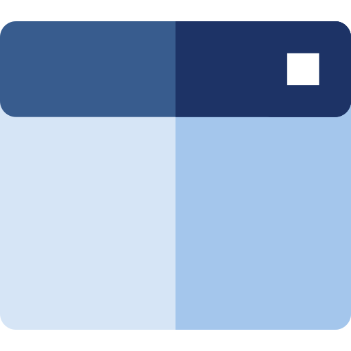

### Hello world, I'm Simon 👋  

  📫 <b>Let’s connect!</b> 

  
  
  

  
  

  

I'm Simon Kobler, a **Senior Software Developer** passionate about making complex systems simple and enabling developers through **scalable, automated, and cloud-native solutions**.  

  

Currently, I’m working at [ **SAP SE**](https://sap.com) in the [**CAP (Cloud Application Programming Model) team**](https://cap.cloud.sap/docs/), where I focus on **plugin development**, **developer support**, and **Kyma integration** for CAP.

---

### 🛠️ Tech Stack & Capabilities

**DevOps & Cloud Platforms**
- Kubernetes, Docker, Ansible  
- AWS, Azure, GCP, Firebase  
- GitHub Actions, GitLab CI/CD, Jenkins  

**Development & Automation**
- JavaScript, TypeScript, Node.js, Python, Java, Swift  
- Angular, Ionic, Spring Boot  
- HTML, CSS, Sass  
- SQL, MongoDB  

**Architecture & Integration**
- Infrastructure as Code (IaC)  
- Third-party integration (AWS, Azure, Firebase, GCP)  
- Full-stack & hybrid mobile applications  

---

### ⚡ What I Do

- Develop and maintain **plugins** to extend CAP functionality  
- Support teams with **Kyma-based cloud extensions** and services  
- Interact and support the [CAP Community](https://github.com/cap-js)  
